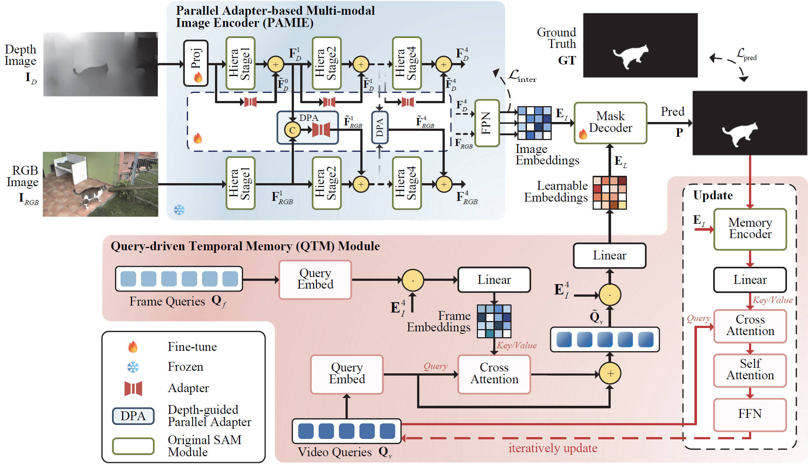

# SAM-DAQ

> **"SAM-DAQ: Segment Anything Model with Depth-guided Adaptive Queries for RGB-D Video Salient Object Detection"**  
> by [*Jia Lin*](mailto:lin_j@hdu.edu.cn), [*Xiaofei Zhou*](mailto:zxforchid@outlook.com), *Jiyuan Liu*, *Runmin Cong*, *Guodao Zhang*, [*Zhi Liu*](mailto:liuzhisjtu@163.com) and *Jiyong Zhang*  
> Accepted at **AAAI Conference on Artificial Intelligence (AAAI 2026), Poster Track**

📑 [Paper (arxiv)](https://arxiv.org/abs/2511.09870) | 🌐 [Project Page](https://github.com/LinJ0866/SAM-DAQ)

## 🧠 Overview

We propose **SAM-DAQ**, which adapts SAM for fully automatic segmentation by seamlessly integrating depth and temporal cues within a unified framework.

  

**Key Highlights:**
- 💡 **Depth-Guided Adaptive Adapter:** enables prompt-free fine-tuning with minimal memory consumption while facilitates effective RGB-D fusion.
- 🧩 **Query-Based Memory:** provides efficient online temporal modeling.

## ⏳ Code Availability

The **source code and checkpoints** will be released **before December 31, 2025**.  
Please stay tuned or ⭐ star this repository to receive updates.

🔔 **Release plan:**

- [x] Paper accepted at AAAI 2026
- [x] Publish the preprint version of the paper
- [ ] Clean up experimental code  
- [ ] Release training and inference pipelines  
- [ ] Provide pretrained checkpoints

