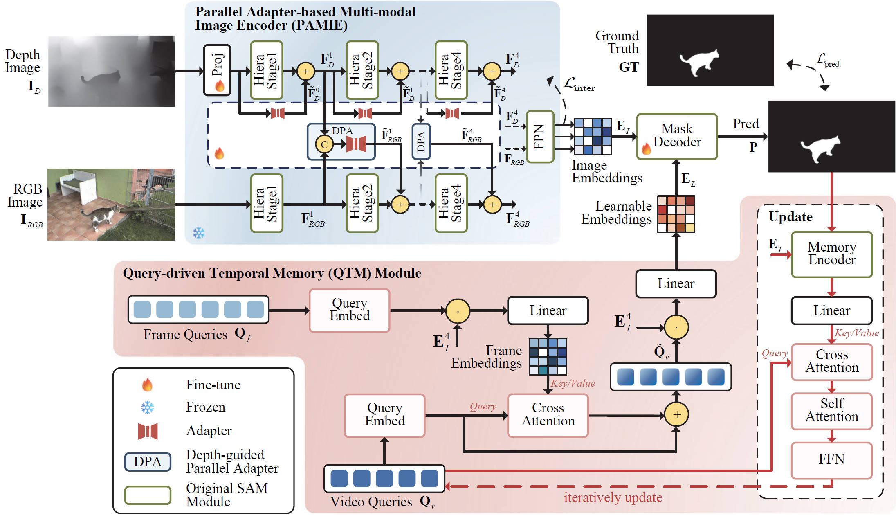

# SAM-DAQ

> **"SAM-DAQ: Segment Anything Model with Depth-guided Adaptive Queries for RGB-D Video Salient Object Detection"**  
> by [*Jia Lin*](mailto:lin_j@hdu.edu.cn), [*Xiaofei Zhou*](mailto:zxforchid@outlook.com), *Jiyuan Liu*, *Runmin Cong*, *Guodao Zhang*, [*Zhi Liu*](mailto:liuzhisjtu@163.com) and *Jiyong Zhang*  
> Accepted at **AAAI Conference on Artificial Intelligence (AAAI 2026), Poster Track**

📑 [Paper (arxiv)](https://arxiv.org/abs/2511.09870) | 🌐 [Project Page](https://github.com/LinJ0866/SAM-DAQ)

## 🧠 Overview

We propose **SAM-DAQ**, which adapts SAM for fully automatic segmentation by seamlessly integrating depth and temporal cues within a unified framework.

  

**Key Highlights:**
- 💡 **Depth-Guided Adaptive Adapter:** enables prompt-free fine-tuning with minimal memory consumption while facilitates effective RGB-D fusion.
- 🧩 **Query-Based Memory:** provides efficient online temporal modeling.

## ⏳ Code Availability

The **source code and checkpoints** will be released **before December 31, 2025**.  
Please stay tuned or ⭐ star this repository to receive updates.

🔔 **Release plan:**

- [x] Paper accepted at AAAI 2026
- [x] Publish the preprint version of the paper
- [x] Clean up experimental code  
- [ ] Release training and inference pipelines  
- [x] Provide pretrained checkpoints

## ⚡ Start

### prepare dataset

- [RDVS](https://github.com/kerenfu/RDVS)
- [ViDSOD-100](https://github.com/jhl-Det/RGBD_Video_SOD)
- [DViSal](https://github.com/DVSOD/DVSOD-DViSal)
  

### pretrain checkpoint download

- Dependent Models: [sam2.1_hiera_large.pt](https://dl.fbaipublicfiles.com/segment_anything_2/092824/sam2.1_hiera_large.pt) (from [facebookresearch/sam2](https://github.com/facebookresearch/sam2))
- Models we provided: [夸克网盘](https://pan.quark.cn/s/d62d908c01ec), [Google Drive](https://drive.google.com/drive/folders/1lfnxN7t-woV8jo-nG83elNPvJCUUDbSd?usp=drive_link)

## Benchmark Results

The benchmark results of our work can be accessed in:

- [夸克网盘](https://pan.quark.cn/s/d62d908c01ec)
- [Google Drive](https://drive.google.com/drive/folders/1702nuNCC515lsil1US6Wn8ReewAXnCbT?usp=drive_link)

## Acknowledgement

The work is based on [MemSAM](https://github.com/dengxl0520/MemSAM) and [SAM2](https://github.com/facebookresearch/sam2). Thanks for the open source contributions to these efforts!